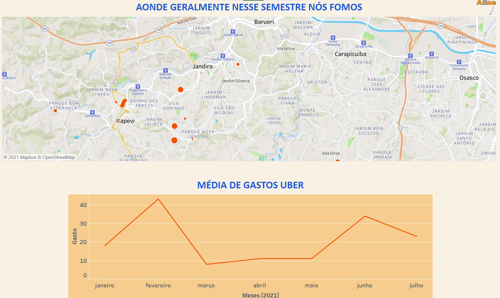
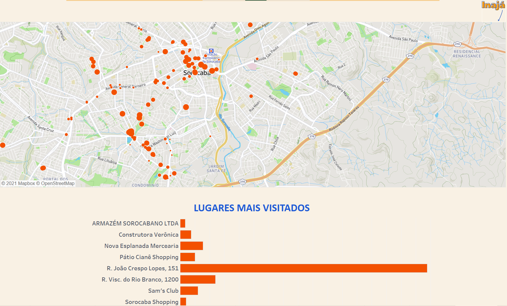
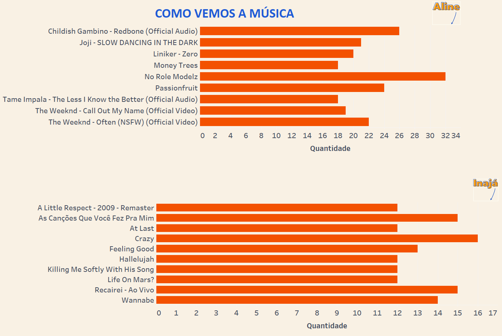
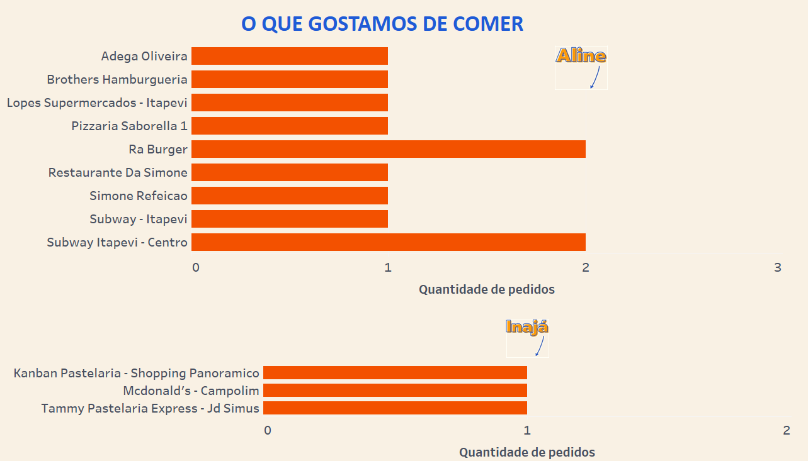

<h1 align="center">🍂 Projeto final 🍂</h1>
 

    
 

 -------
 ### 🍂 Contexto 🍂
* No projeto final do curso de análise de dados foram utilizadas bases de dados pessoais de empresas que a Inajá Morais e Aline Santos utilizam como serviços.

* As empresas que foram utilizadas como fonte da dados: Uber, Google Maps, Youtube, Spotify e Ifood.

--------
### 🍂 Visualização dos dados 🍂 
 
 

    
 

  

    
 

  

    
 

  

    
 

-------------
<h3 align= "center"> 🍂 Colaboradoras do projeto 🍂 </h3>

<table align="center">
 <td align="center"> 
         <b>Aline Santos</b> 
        <a href="">
            
            
        

            </a>
            
       

</td>
  <td align="center"> 
<<<<<<< HEAD
         <b>Inajá Morais</b>
=======
         <b>Inajá Morais</b> 
>>>>>>> b46ce35aee637e0df19e333fbad498957b233d05
        <a href="">
            
            
        

            </a>    
            
       

</td>

</table>
